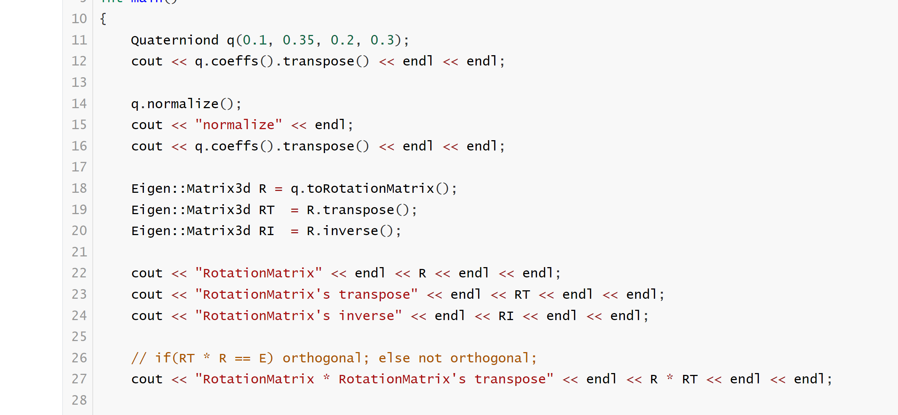

# HW02 相机位姿编程

已知相机的位姿用四元数表示为q=[0.35,0.2,0.3,0.1],顺序为x,y,z,w，请编程实现： 输出四元数对应的旋转矩阵、旋转矩阵的转置，旋转矩阵的逆矩阵，旋转矩阵乘以自身的转置，验证旋转矩阵的正交性。

> 熟悉cmake的使用、学习eigen的基本操作；根据实践验证旋转矩阵的约束 

## CMakeLists.txt

```cmake
cmake_minimum_required(VERSION 3.22)
project(hw02)

set(CMAKE_CXX_STANDARD 20)

add_executable(hw02 hw02.cpp)
```

## hw02.cpp

```c++
#include <iostream>
#include <cmath>
#include <Eigen/Core>
#include <Eigen/Geometry>
using namespace std;
int main() {
    Eigen::Quaterniond q(0.1,0.35,0.2,0.3);
    Eigen::Matrix3d rotation_matrix = q.normalized().toRotationMatrix();  // 四元数转旋转矩阵
    cout << "旋转矩阵： r= \n" << rotation_matrix << endl;
    Eigen::Matrix3d rotation_matrix_t = rotation_matrix.transpose();  // 旋转矩阵转置
    cout << "旋转矩阵转置后： rt= \n" << rotation_matrix_t << endl;
    Eigen::Matrix3d rotation_matrix_inv = rotation_matrix.inverse();  // 旋转矩阵的逆
    cout << "旋转矩阵的逆矩阵： r.inv= \n" << rotation_matrix_inv << endl;
    Eigen::Matrix3d rotation_matrix_rrt = rotation_matrix * rotation_matrix_t;  //旋转矩阵乘以自身的转置
    cout << "旋转矩阵乘以自身的转置： r*rt= \n " << rotation_matrix_rrt << endl;
    return 0;
}

```

```cmake
cmake_minimum_required(VERSION 3.16)

project(homework02)

# 添加 Eigen 头文件
include_directories("/usr/include/eigen3")
add_executable(useMatrix useMatrix.cpp)
```


```c++
#include <iostream>

#include <Eigen/Core>
#include <Eigen/Dense>

using namespace std;
using namespace Eigen;

int main()
{
    Quaterniond q(0.1, 0.35, 0.2, 0.3);
    cout << q.coeffs().transpose() << endl << endl;

    q.normalize();
    cout << "normalize" << endl;
    cout << q.coeffs().transpose() << endl << endl;

    Eigen::Matrix3d R = q.toRotationMatrix();
    Eigen::Matrix3d RT  = R.transpose();
    Eigen::Matrix3d RI  = R.inverse();

    cout << "RotationMatrix" << endl << R << endl << endl;
    cout << "RotationMatrix's transpose" << endl << RT << endl << endl;
    cout << "RotationMatrix's inverse" << endl << RI << endl << endl;

    // if(RT * R == E) orthogonal; else not orthogonal;
    cout << "RotationMatrix * RotationMatrix's transpose" << endl << R * RT << endl << endl;
    
}

```


